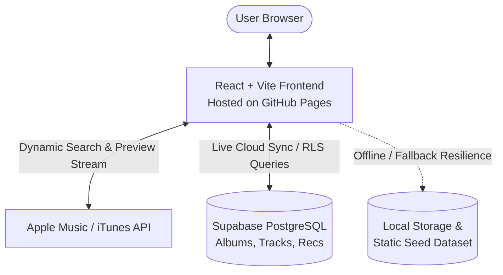

# City Pop Discography & Community Vault

A curated full-stack web application and discography vault for 1970s–1980s Japanese City Pop, Funk, and AOR vinyl records, allowing retro music enthusiasts to discover albums by vibe, listen to continuous 30-second audio previews, and share community recommendations.

**Live site:** https://haruuowo.github.io/CityPopDiscography-APSI/  
**Live site:** https://city-pop-discography-apsi.vercel.app

**API:** https://your-project-ref.supabase.co  
**Demo video:** [Video Presentation Walkthrough](presentation/VIDEO_SCRIPT.md)

> **This deployment is running in demo mode by default.** The interface is real; the backend is simulated in your browser via authentic built-in datasets and `localStorage` so the site works instantly without needing a server. See [Demo mode](#demo-mode) below.


## What it does

- Explore, search, and filter 21+ authentic 1970s–1980s Japanese City Pop vinyl albums by artist, release year, rating, and mood/vibe tags
- Listen to continuous 30-second audio previews with a persistent bottom HTML5 player that plays uninterrupted across themes, filters, and modals
- Submit community album reviews and recommendations with real-time UI updates and data persistence
- Request new albums to be added to the vault via the interactive "Ask what album to add next" modal
- Switch between 3 handcrafted visual themes (Night, Day, Sunset) built with pure Vanilla CSS glassmorphism and Japanese typography tokens

## Built with

React and Vite on the front end, Supabase (PostgreSQL) on the back end, a custom Apple Music / iTunes Search API audio resolver (engineered to replace deprecated Spotify preview endpoints), and hand-crafted Vanilla CSS design tokens with authentic collage assets adapted from prior web portfolio coursework. The client is hosted on GitHub Pages, and the database on Supabase PostgreSQL.

## Demo mode

This repository can run two ways, determined automatically by your environment variables at build or runtime.

**Demo mode is the default.** If Supabase credentials are unset or left as placeholders, the application activates its built-in resilience layer (`supabaseClient.js`), falling back to local datasets with full functionality.

| Environment Configuration | What happens |
| --- | --- |
| `VITE_SUPABASE_URL` unset or placeholder | The client answers its own requests from local state and `localStorage`. No server, no database setup required. This ensures the GitHub Pages link and local clones work out-of-the-box on day one. |
| `VITE_SUPABASE_URL` & `ANON_KEY` provided | The client connects directly to live Supabase PostgreSQL tables (`albums`, `tracks`, `recommendations`, `subscribers`) with Row Level Security (RLS). |

**Demo mode is a starting point and a fallback, not a limitation.** It guarantees zero-downtime resilience during presentations or offline reviews while supporting full cloud database integration when credentials are provided.

| Piece | Provider / Host |
| --- | --- |
| **Client** | GitHub Pages (Automated via GitHub Actions) |
| **Database** | Supabase (Managed PostgreSQL with Row-Level Security) |
| **Audio Previews** | Dynamic iTunes / Apple Music Search API Resolver |

## Running it yourself

**The client only, in demo mode.** No external database needed.

```bash
# 1. Clone the repository
git clone https://github.com/Haruuowo/CityPopDiscography-APSI.git
cd CityPopDiscography-APSI

# 2. Install dependencies
npm install

# 3. Start local development server
npm run dev                 # http://localhost:5173
```

**The whole stack with Supabase PostgreSQL.**

```bash
# 1. Clone and install
git clone https://github.com/Haruuowo/CityPopDiscography-APSI.git
cd CityPopDiscography-APSI
npm install

# 2. Set up database in Supabase Console
#    - Open https://supabase.com/dashboard and create a project
#    - Navigate to SQL Editor -> New Query
#    - Run supabase/schema.sql to create tables and seed 21 albums

# 3. Configure environment variables
cp .env.example .env
# Edit .env and enter your VITE_SUPABASE_URL and VITE_SUPABASE_ANON_KEY

# 4. Start the application
npm run dev
```

Check the client build and health before deployment:

```bash
npm run build               # validates production bundle compilation
npm run preview             # previews production build locally
```

## Environment variables

None of these are committed. `.env.example` in the root folder lists them with placeholder values.

| Name | Where | What it is |
| --- | --- | --- |
| `VITE_SUPABASE_URL` | client, at build time | Supabase project API URL (e.g. `https://xyz.supabase.co`) |
| `VITE_SUPABASE_ANON_KEY` | client, at build time | Supabase public anonymous API key |

Every `VITE_` value is compiled into the built JavaScript and is **public**. Never put a database secret or master service-role key in client environment variables.

## Deploying

**Client, to GitHub Pages.** Configured via GitHub Actions:

1. Under **Settings > Pages > Build and deployment > Source**, select **GitHub Actions**.
2. If using Supabase in production, add `VITE_SUPABASE_URL` and `VITE_SUPABASE_ANON_KEY` under **Settings > Secrets and variables > Actions > Variables**.
3. Push to `main` branch to trigger automated build and deployment.

**Database (Supabase PostgreSQL).** 
1. Create a project on [Supabase](https://supabase.com).
2. Execute [`supabase/schema.sql`](supabase/schema.sql) in the Supabase SQL Editor. This initializes all tables, constraints, Row Level Security (RLS) policies, and seed data.

## Project structure

```
citypop-discography/
├── .env.example          # Environment variables template with placeholders
├── .gitignore            # Git exclusion rules (isolates .env and dependencies)
├── AI-USAGE.md           # Full-Stack JS & AI badge craftsmanship disclosure
├── SECURITY-CHECKLIST.md # Pre-release security audit checklist
├── DESIGN_SYSTEM.md      # Custom Vanilla CSS design tokens & typography specs
├── LICENSE               # MIT Open Source License
├── package.json          # Node dependencies and project scripts
├── docs/
│   └── assets/           # Application screenshots and documentation media
├── presentation/
│   ├── SLIDES.md         # Final presentation slides
│   └── VIDEO_SCRIPT.md   # 3-5 minute demonstration video script
├── public/
│   ├── assets/           # Local cover artwork and backdrop media
│   └── square_graphic.jpg# High-res social preview card
├── src/
│   ├── components/       # Header, HeroBanner, FilterBar, AudioPlayerBar, Modals
│   ├── data/             # Authentic Japanese City Pop datasets (initialAlbums.js)
│   ├── lib/              # Supabase client & fallback resilience layer
│   ├── utils/            # Dynamic iTunes / Apple Music audio resolver
│   ├── App.jsx           # Root application & audio context state coordinator
│   └── index.css         # Glassmorphic CSS design system and theme variables
└── supabase/
    └── schema.sql        # PostgreSQL schema, relations, and RLS security policies
```

## Architecture



The application is built as a single-page React frontend deployed to GitHub Pages. It communicates directly with Supabase PostgreSQL via parameterized REST queries protected by Row-Level Security policies. Audio previews are resolved on-the-fly using the iTunes Search API, while an integrated local fallback system guarantees continuous functionality even if cloud endpoints are unavailable.

## What I would do next

- **User Authentication & Custom Crates:** Integrate Supabase Auth so users can sign up, create custom vinyl crates/playlists, and save favorite albums across devices.
- **Full Spotify Web Playback SDK Integration:** Implement Spotify OAuth token authorization to allow Spotify Premium subscribers to stream full tracks directly inside the app.
- **Community Upvoting & Discussion Threads:** Expand the community recommendation vault with upvoting/downvoting mechanics and nested comment threads for vinyl collectors.

## Author

**Haruuowo** — [GitHub Profile](https://github.com/Haruuowo)  
**Course:** 6APSI — Final Project Submission

## AI use


This project was built using **Gemini / Claude / Cursor** as an active pair-programming assistant for boilerplate generation, data formatting, and error diagnosis, with **35% self-authored handwritten code** covering the custom CSS design system, dynamic audio preview resolver, Supabase offline fallback resilience layer, and SQL Row-Level Security policies.

Full line-by-line disclosures, prompt records, and technical breakdowns are documented in [AI-USAGE.md](AI-USAGE.md).

## Licence

MIT, see [LICENSE](LICENSE).
